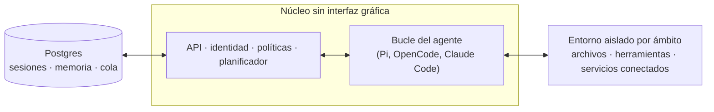

# qm

Un soporte para agentes multijugador diseñado para el trabajo. Disponible en Slack y en la web. Está construido pensando en el código abierto. Elige tu propio soporte y modelo, y cámbialos según lo necesites: Pi, OpenCode, Codex y Claude Code utilizan todos el mismo núcleo, por lo que la implementación no está vinculada a un único proveedor.


## ¿Qué es QM?

La mayoría de los agentes están diseñados como asistentes personales. Puedes hacer que uno trabaje para toda una empresa, pero rápidamente se vuelve complejo. QM está pensado para startups. Cada empleado dispone de su propio espacio de trabajo aislado y trabaja de forma independiente sin afectarse mutuamente, aunque también pueden colaborar con el agente en canales, mensajes grupales y proyectos.

Cada persona y cada sala tiene su propia memoria, archivos, vista del llavero digital, permisos, tareas programadas, aplicaciones web y entorno aislado propio.

Está construido pensando en el código abierto. Elige tu propio soporte y modelo, y cámbialos según lo necesites: Pi, OpenCode, Codex y Claude Code utilizan todos el mismo núcleo, por lo que la implementación no está vinculada a un único proveedor.

## Características

- **Ámbitos personales y compartidos.** Las personas personalizan el agente para que sea *suyo*, y aun así pueden trabajar en colaboración en canales de Slack y proyectos.
- **Slack y web.** La misma identidad y configuración se mantienen tanto en Slack como en la aplicación web.
- **Control administrativo.** Configura parámetros a nivel de organización, políticas de seguridad y determina qué soportes y modelos están disponibles.
- **Aplicaciones web.** Crea aplicaciones internas personalizadas y envíalas a las personas adecuadas.
- **Habilidades compartidas.** Las habilidades pertenecen al ámbito específico y pueden compartirse mediante autorización; existe una opción para promoverlas a toda la organización bajo supervisión administrativa, además de paquetes de habilidades importados desde repositorios Git.
- **Trabajo en segundo plano.** Las tareas programadas y monitores ejecutan operaciones mientras nadie las observa.

## Qué puedes hacer con él

- Buscar notas internas, correos electrónicos, documentos, bases de datos y contenido de la web al mismo tiempo.
- Obtener información del “cerebro” de tu empresa.
- Desarrollar aplicaciones internas, publicarlas para las personas adecuadas y mantener sus datos actualizados.
- Aprender tu estilo de escritura a partir de mensajes anteriores y luego organizar tu bandeja de entrada según un calendario, incluyendo etiquetas y borradores de respuestas.
- Trabajar en un repositorio existente: ejecutar pruebas, abrir solicitudes de revisión, monitorear procesos CI y revisar registros del sistema.
- Seguir el progreso de un proyecto en un canal compartido y publicar actualizaciones y seguimientos.

## Arquitectura



Cada acción pasa por un núcleo central, que puede utilizar diversos modelos y soportes para generar la respuesta. Una capa de persistencia basada en Postgres almacena los datos de los usuarios, el historial de sesiones y otros estados duraderos. El agente cuenta con una pequeña superficie de herramientas fija; una de ellas es `execute`, que ejecuta comandos en el entorno aislado propio del ámbito —su computadora duradera, donde las herramientas instaladas permanecen instaladas. La interfaz web, el panel administrativo y el portal público son complementos opcionales sobre la API HTTP del núcleo; Slack es un complemento opcional que se inicia y supervisa desde el núcleo mediante un cliente de servicio directo.

El núcleo ejecuta TypeScript directamente en Node y utiliza Fastify para HTTP. El complemento de Slack emplea Bolt; la interfaz web se construye con Vite y se renderiza con Lit.

El propio núcleo es genérico. Todo lo específico de una empresa —configuración de organización, herramientas y habilidades personalizadas, imagen del entorno aislado, infraestructura— se encuentra en un **directorio de despliegue** que la CLI [`qm`](./cli/README.md) valida e implementa. Cada componente (soporte, almacenamiento de sesiones, entorno aislado, memoria) está detrás de una interfaz, por lo que las implementaciones en producción se sustituyen mediante un único archivo de conexión.

## Seguridad y secretos

El enfoque de QM sigue el modelo de agentes de codificación locales como OpenCode, Codex y Claude Code: el agente actúa como la persona para quien trabaja, utilizando sus credenciales y permisos, y todo lo que hace está sujeto a auditoría. Una organización elige un nivel de seguridad, y los ámbitos más restringidos solo pueden endurecerlo aún más:

- **Estricto** —cada llamada a una herramienta del soporte se detiene para obtener aprobación humana, excepto los dos terminadores de turno que no generan efecto alguno.
- **Automático** (por defecto) —un clasificador filtra los datos externos etiquetados y los resultados de las herramientas antes de que lleguen al modelo; un despliegue puede dirigir esa filtración a su propio proxy de análisis.
- **Peligroso** —sin filtrado de contenido y sin pausas entre llamadas a herramientas.

La política de comandos predefinida —reglas de aprobación y denegaciones explícitas para operaciones como eliminaciones recursivas o consultas SQL destructivas— se aplica en todos los niveles de seguridad, incluido el “Peligroso”.

[`SECURITY.md`](./SECURITY.md) contiene el modelo de amenazas, las suposiciones sobre el operador y las limitaciones conocidas.

## Implementarlo en tu organización

Crea un repositorio de despliegue propiedad de la organización que dependa de `@yc-software/qm`:

```bash
npm exec --yes --package=@yc-software/qm@latest -- \
  qm init. --org <slug> --target <fly-or-aws>
npm install
```

La inicialización crea una habilidad de despliegue para el agente y aborda aspectos como la infraestructura, el inicio de sesión web, las credenciales de los conectores, el acceso opcional a Slack, el despliegue y la verificación en tiempo real; no es necesario descargar el código fuente. Cada despliegue se ejecuta en la cuenta de nube del operador; la inicialización no genera ni activa procesos CI de despliegue, y este repositorio no cuenta con un flujo de trabajo de despliegue en producción. Consulta [`deployment.md`](./deployment.md) para más detalles.

## Contribuciones

Aceptamos contribuciones en forma de texto escrito por personas, no de código; consulta [`CONTRIBUTING.md`](./CONTRIBUTING.md). Describe informalmente el cambio que deseas realizar en un archivo `.txt` o `.md` dentro de [`adrs/`](./adrs/); si estamos de acuerdo, nos encargaremos de su implementación. Reporta vulnerabilidades de forma privada; consulta [`SECURITY.md`](./SECURITY.md), no mediante un problema público.

## Personalizar tu instancia

El repositorio de despliegue mencionado anteriormente ya incluye configuraciones y una capa de entorno aislado, por lo que nunca es necesario descargar el código fuente. Algunas organizaciones prefieren lo contrario: tener todo el código base en un único lugar, de modo que los ingenieros y los agentes de codificación puedan leer tanto el núcleo como las personalizaciones al mismo tiempo, manteniendo las personalizaciones en privado. Para ello, crea un **fork privado**: un repositorio privado independiente cuyo historial comienza como una copia de qm y cuyo núcleo es idéntico al original.

Rellénalo una vez y luego clónalo para usarlo:

```bash
gh repo create <org>/qm-private --private

git clone --bare git@github.com:yc-software/qm qm-seed.git
git -C qm-seed.git push --mirror git@github.com:<org>/qm-private
rm -rf qm-seed.git

git clone git@github.com:<org>/qm-private
git -C qm-private remote add upstream git@github.com:yc-software/qm
```

Crea el fork privado mediante una clonación simple, como se muestra arriba, y nunca usando la función de fork de GitHub. La palabra “fork” aquí se refiere al concepto de una copia derivada que se separa intencionadamente del origen y se fusiona con él, no al botón “Fork” de GitHub. Un fork de GitHub hereda la visibilidad del repositorio del que proviene, por lo que un fork de un repositorio público no puede volverse privado. Además, un fork de GitHub comparte la misma red de objetos que el repositorio original, por lo que los commits enviados al fork siguen siendo accesibles mediante SHA desde el lado público. Muchas organizaciones también prohíben crear forks de repositorios privados. Una clonación simple no presenta ninguno de estos problemas, y tiene una única desventaja: el clon es un repositorio normal, por lo que los flujos de trabajo CI del origen se ejecutan en tu propia cuenta. Deberás proporcionar los secretos que esos flujos necesitan, o desactivar aquellos que no quieras que se ejecuten.

Todo lo específico de tu organización se coloca en `deploy/layers/<org>/` —configuraciones, herramientas y habilidades del entorno aislado, imágenes de complementos, infraestructura— siguiendo la misma estructura que genera `qm init`. Consulta [`deploy/layers/README.md`](./deploy/layers/README.md). El núcleo permanece idéntico en bytes al original, lo que permite que las fusiones sean pequeñas.

Dos habilidades mantienen la separación en ambas direcciones. `update-qm` fusiona el qm del origen en el fork privado y abre la solicitud de sincronización; `upstream-pr` envía una corrección independiente de la organización de vuelta a qm, cortando la rama desde `upstream/main` y revisando la diferencia, los mensajes de commit y las capturas de pantalla en busca de identificadores de la organización antes de hacer el push. Nada que esté bajo `deploy/layers/` llega jamás al origen.

## Profundizando más

- [`docs/getting-started.md`](./docs/getting-started.md) —primera ejecución, proceso completo.
- [`cli/README.md`](./cli/README.md) —la CLI `qm` y el contrato del directorio de despliegue.
- [`docs/deploy-directory.md`](./docs/deploy-directory.md) —el directorio de despliegue en detalle.
- [`.env.example`](./.env.example) —toda configuración documentada en su lugar.
- [`plugins/`](./plugins) —las interfaces (Slack, interfaz web, administración, portal).

## Licencia

Salvo que se indique lo contrario, QM se distribuye bajo la [Licencia MIT](./LICENSE).
