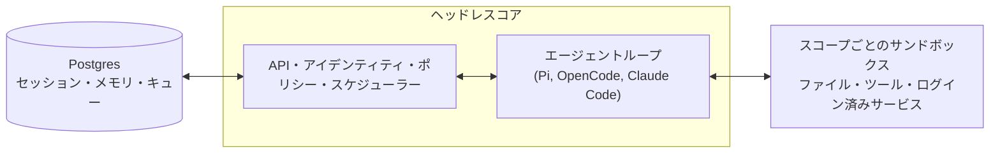

# qm

業務向けのマルチプレイヤーエージェントハーネス。Slack でもウェブ上でも利用可能です。オープンソースを念頭に設計されており、ご自身でハーネスやモデルを選んで切り替えることができます。Pi、OpenCode、Codex、Claude Code はすべて同じコアを使用しているため、デプロイ先は特定のベンダーに縛られません。


## QM とは？

ほとんどのエージェントはパーソナルアシスタントのように設計されています。1 つのエージェントで会社全体を支えることも可能ですが、すぐに複雑になってしまいます。QM はスタートアップ向けに設計されており、従業員一人ひとりが独立したワークスペースを持ち、互いに干渉することなく作業できます。また、チャネルやグループメッセージ、プロジェクト内でエージェントと協力することも可能です。

各ユーザーや各部屋には、独自のメモリ範囲、ファイル、キーチェーンビュー、権限、Cron、ウェブアプリ、永続的なサンドボックスがあります。

オープンソースを念頭に設計されており、ご自身でハーネスやモデルを選んで切り替えることができます。Pi、OpenCode、Codex、Claude Code はすべて同じコアを使用しているため、デプロイ先は特定のベンダーに縛られません。

## 機能

- **個人用および共有用のスコープ**。ユーザーはエージェントを自分専用にカスタマイズしつつ、Slack のチャネルやプロジェクト内で他者と協力して利用できます。
- **Slack とウェブ**。同一のアイデンティティと設定が Slack とウェブアプリの間で引き継がれます。
- **管理者制御**。組織レベルの設定やセキュリティポリシー、利用可能なハーネスやモデルを指定できます。
- **ウェブアプリ**。カスタムの内部アプリを作成し、適切なユーザーに公開できます。
- **共有スキル**。スキルは各スコープに属し、許可に基づいて共有できます。管理者が承認すれば組織全体に配布でき、git リポジトリからスキルパックをインポートすることも可能です。
- **バックグラウンド処理**。誰も見ていない間でも Cron や監視機能によって処理が実行されます。

## これを使ってできること

- 社内のメモ、メール、文書、データベース、ウェブを一括して検索する
- 会社の情報システムから情報を取得する
- 社内アプリを構築し、適切なユーザーに公開してデータを常に最新の状態に保つ
- 過去の送信内容から自分の文章スタイルを学び、定期的に受信箱を整理する（ラベル付けや返信ドラフトも含む）
- 既存のリポジトリで作業する：テストの実行、PR の開始、CI の監視、システムログの確認
- 共有チャネルでプロジェクトを追跡し、更新情報やフォローアップを投稿する

## アーキテクチャ



各処理は中央のコアを経由して実行され、そこではさまざまなモデルやハーネスを使って応答が生成されます。Postgres の永続層にはユーザーデータ、セッション履歴、その他の永続的な状態が保存されます。エージェントには小規模で固定されたツール群があり、その中の 1 つが `execute` で、これはスコープ固有のサンドボックス内でコマンドを実行します。このサンドボックスは永続的なコンピュータであり、インストールされたツールは常に残り続けます。ウェブ UI、管理者パネル、パブリックポータルは、コアの HTTP API 上にあるオプションのプラグインです。Slack はコアが直接サービスクライアントを通じて起動・監視するオプションのインプロセスプラグインです。

コア自体は Node 上で TypeScript を直接実行し、HTTP 通信には Fastify を使用します。Slack プラグインは Bolt を使用し、ウェブ UI は Vite で構築され、Lit でレンダリングされます。

コア自体は汎用的な構造を持っています。特定の企業に固有の要素——組織設定、カスタムツールやスキル、サンドボックスイメージ、インフラ——はすべて **デプロイメントディレクトリ** に格納され、[`qm` CLI](./cli/README.md) によって検証されてデプロイされます。各サブストラクチャ（ハーネス、セッションストア、サンドボックス、メモリ）はインターフェースの背後に存在し、実際の環境では 1 つのワイヤリングファイルを通じて切り替えられます。

## セキュリティと機密情報

QM のアプローチは OpenCode、Codex、Claude Code といったローカルコーディングエージェントと同様で、エージェントは自分が所属する組織のユーザーとして振る舞い、その資格情報や権限を持って行動し、すべての操作が監査されます。組織はセキュリティポリシーを選択し、より狭いスコープではそれをさらに厳格化できます。

- **Strict** — 2 つの無効化用の終了処理を除き、すべてのハーネスツール呼び出しは人間の承認を待ちます。
- **Auto**（デフォルト） — 分類器が外部データやツールの結果に付与された出所情報をモデルに届く前にチェックします。デプロイ先は自身のスクリーニングプロキシを指定できます。
- **Dangerous** — コンテンツのチェックもツール呼び出し間の一時停止も行われません。

事前に定義されたコマンドポリシー——承認ルールや再帰的な削除や破壊的な SQL といった操作の強制的な拒否——は、Dangerous を含むすべてのポリシーで適用されます。

[`SECURITY.md`](./SECURITY.md) には脅威モデル、運用者の前提条件、既知の制限事項が記載されています。

## 自社向けにデプロイする

`@yc-software/qm` に依存する、組織所有のデプロイメントリポジトリを作成します：

```bash
npm exec --yes --package=@yc-software/qm@latest -- \
  qm init. --org <slug> --target <fly-or-aws>
npm install
```

この初期化処理により、エージェント用のデプロイメントスキルが作成され、インフラ、ウェブサインイン、コネクタの資格情報、オプションの Slack アクセス、デプロイ、ライブ検証までが自動的に行われます。ソースコードのチェックアウトは不要です。各デプロイは運用者自身のクラウドアカウント内で実行され、初期化処理ではデプロイ用の CI は生成されず有効にもならず、このリポジトリには本番環境向けのデプロイワークフローもありません。詳細は [`deployment.md`](./deployment.md) を参照してください。

## 貢献方法

私たちはコードではなく「人が書いた」テキストとしての貢献を受け付けています。[`CONTRIBUTING.md`](./CONTRIBUTING.md) をご覧ください。変更内容を簡潔に `.txt` または `.md` ファイルとして [`adrs/`](./adrs/) に保存してください。内容が合致していれば、私たちが実装を担当します。脆弱性が見つかった場合は非公開で報告してください。[`SECURITY.md`](./SECURITY.md) を参照し、公開の Issue は送らないでください。

## インスタンスをカスタマイズする

前述のデプロイメントリポジトリには設定やサンドボックス層が含まれており、ソースコードのチェックアウトは一切不要です。一方で、コードベースを 1 か所にまとめ、エンジニアやコーディングエージェントがコアとカスタマイズ内容を一緒に閲覧しつつ、カスタマイズ自体は非公開にしたいと考える組織もあります。その場合は **プライベートフォーク** を作成してください。これは独立したプライベートリポジトリで、その履歴は qm のクローンから始まり、コアは元のリポジトリと完全に同一です。

一度内容を入力し、作業用にクローンします：

```bash
gh repo create <org>/qm-private --private

git clone --bare git@github.com:yc-software/qm qm-seed.git
git -C qm-seed.git push --mirror git@github.com:<org>/qm-private
rm -rf qm-seed.git

git clone git@github.com:<org>/qm-private
git -C qm-private remote add upstream git@github.com:yc-software/qm
```

プライベートフォークは上記のように通常のクローンで作成し、GitHub のフォーク機能を使ってはいけません。「フォーク」という言葉は、意図的に分岐して元のリポジトリからマージされる下流のコピーを指し、GitHub のフォークボタンとは異なります。GitHub のフォークは元のリポジトリの可視性を継承するため、公開リポジトリのフォークをプライベートにすることはできません。また、GitHub のフォークは元のリポジトリと同じオブジェクトネットワークを共有するため、フォークにプッシュされたコミットは公開側から SHA で取得可能です。多くの組織ではプライベートリポジトリのフォークも禁止されています。通常のクローンにはこれらの問題はなく、唯一の注意点は、クローンされたリポジトリは通常のリポジトリとなるため、元のリポジトリの CI ワークフローが自分のアカウント内で実行される点です。これらのワークフローに必要な機密情報を提供するか、不要なものは無効化する必要があります。

組織固有の内容はすべて `deploy/layers/<org>/` に格納されます。設定、サンドボックス内のツールやスキル、プラグインイメージ、インフラなどが含まれ、形式は `qm init` で生成されるものと同じです。詳細は [`deploy/layers/README.md`](./deploy/layers/README.md) を参照してください。コアは元のリポジトリとバイト単位で同一であるため、マージ時の変更量が少なくなります。

2 つのスキルが双方向で境界を管理します。`update-qm` は元の qm をプライベートフォークにマージし、同期用の PR を開きます。`upstream-pr` は組織に依存しない修正内容を qm に送り返し、`upstream/main` からブランチを切り離し、プッシュする前に差分、コミットメッセージ、スクリーンショットに組織識別子が含まれていないかを確認します。`deploy/layers/` 以下の内容は決して元のリポジトリには送信されません。

## より深く知る

- [`docs/getting-started.md`](./docs/getting-started.md) — 初回実行からエンドツーエンドまで
- [`cli/README.md`](./cli/README.md) — `qm` CLI とデプロイメントディレクトリの仕様
- [`docs/deploy-directory.md`](./docs/deploy-directory.md) — デプロイメントディレクトリの詳細
- [`.env.example`](./.env.example) — 各設定項目がその場で説明されている
- [`plugins/`](./plugins) — 各種インターフェース（Slack、ウェブ UI、管理者用、ポータル）

## ライセンス

特に記載がない限り、QM は [MIT ライセンス](./LICENSE) の下で提供されます。
