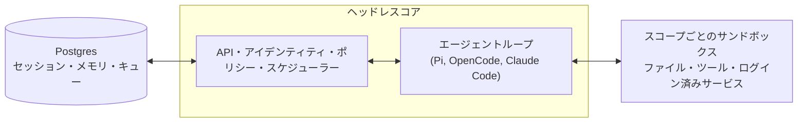

# qm

[English](./README.md) | **日本語** | [Español](./README_es.md) | [中文](./README_zh-CN.md) | [한국어](./README_ko.md)


業務向けのマルチプレイヤーエージェントハーネス。Slack およびウェブ上で利用可能です。


## QM とは？

ほとんどのエージェントはパーソナルアシスタントのように設計されています。1 つのエージェントを会社全体で使えるようにすることも可能ですが、すぐに複雑になってしまいます。QM はスタートアップ向けに設計されており、従業員一人ひとりが独立したワークスペースを持ち、互いに干渉することなく作業できます。また、チャネルやグループメッセージ、プロジェクト内でエージェントと協力することも可能です。

各ユーザーや各部屋には、独自のメモリ領域、ファイル、キーチェーンの表示、権限設定、クローンジョブ、ウェブアプリ、そして永続的なサンドボックスが割り当てられます。

QM はオープンソースを前提として構築されています。自分好みのハーネスやモデルを選んで切り替えることができ、Pi、OpenCode、Codex、Claude Code はすべて同じコアを使用しているため、デプロイ先は特定のベンダーに縛られません。

## 機能

- **個人用および共有用のスコープ**。ユーザーはエージェントを自分専用にカスタマイズしつつ、Slack のチャネルやプロジェクト内で他者と協力して利用できます。
- **Slack とウェブ**。同じアイデンティティと設定が Slack とウェブアプリの間で引き継がれます。
- **管理者制御**。組織全体の設定やセキュリティポリシー、利用可能なハーネスやモデルを指定できます。
- **ウェブアプリ**。独自の内部アプリを開発し、適切なユーザーに公開できます。
- **共有スキル**。スキルは各スコープ単位で管理され、許可を与えることで共有可能です。管理者が承認すれば組織全体に展開でき、git リポジトリからスキルパックをインポートすることもできます。
- **バックグラウンド処理**。誰も見ていない間でもクローンジョブや監視処理が実行されます。

## このツールでできること

- 社内のメモ、メール、ドキュメント、データベース、ウェブ上の情報を一括して検索する
- 会社の情報基盤から情報を取得する
- 社内アプリを開発し、適切なユーザーに公開してデータを常に最新の状態に保つ
- 過去の送信内容から自身の文章スタイルを学び、定期的に受信トレイを整理する（ラベル付けや返信下書きも含む）
- 既存のリポジトリで作業する：テストの実行、PR の開始、CI の監視、システムログの確認
- 共有チャネルでプロジェクトの進捗を追跡し、更新情報やフォローアップを投稿する

## アーキテクチャ



各処理は中央のコアを経由して実行され、そのコアはさまざまなモデルやハーネスを利用して応答を生成します。Postgres を用いた永続層がユーザーデータ、セッション履歴、その他の永続的な状態を保存します。エージェントには小規模で固定されたツール群があり、その中の 1 つが `execute` で、これはスコープ固有のサンドボックス内でコマンドを実行します。このサンドボックスは永続的なコンピュータのようなもので、インストールされたツールは常に保持されます。ウェブ UI、管理者パネル、パブリックポータルはコアの HTTP API 上に実装されるオプションのプラグインです。Slack はコアが直接起動・監視するオプションのインプロセスプラグインで、サービスクライアントを介して接続されます。

コアは Node 上で TypeScript を直接実行し、HTTP 通信には Fastify を使用します。Slack プラグインは Bolt を利用し、ウェブ UI は Vite で構築され、Lit でレンダリングされます。

コア自体は汎用的な設計です。各企業固有の要素——組織設定、カスタムツールやスキル、サンドボックスのイメージ、インフラ——はすべて **デプロイディレクトリ** に格納され、[`qm` CLI](./cli/README.md) によって検証されてデプロイされます。各種サブストラクチャ（ハーネス、セッションストア、サンドボックス、メモリ）はインターフェースの背後に存在し、実運用環境では 1 つのワイアリングファイルを通じて切り替えられます。

## セキュリティと機密情報

QM のアプローチは OpenCode、Codex、Claude Code といったローカルコーディングエージェントと同様で、エージェントは自身が所属する組織のユーザーとして振る舞い、その資格情報や権限を持って行動し、すべての操作は監査されます。組織はセキュリティポリシーを 1 つ選択し、より狭いスコープではそれをさらに厳格化することができます。

- **Strict** — 2 つの無効化用の終了処理を除き、すべてのハーネスツール呼び出しは人間の承認を待ちます。
- **Auto**（デフォルト） — 分類器が外部データやツールの結果に付与された出所情報をモデルに届く前にチェックします。デプロイ先は自身のスクリーニングプロキシを指定できます。
- **Dangerous** — コンテンツのチェックもツール呼び出し間の一時停止も行われません。

事前に定義されたコマンドポリシー——承認ルールや再帰的な削除や破壊的な SQL といった行為への厳格な禁止——は、Dangerous を含むすべてのポリシーで適用されます。

[`SECURITY.md`](./SECURITY.md) には脅威モデル、運用上の前提条件、既知の制限事項が記載されています。

## 自社向けにデプロイする

`@yc-software/qm` を依存関係とする、組織所有のデプロイリポジトリを作成します：

```bash
npm exec --yes --package=@yc-software/qm@latest -- \
  qm init. --org <slug> --target <fly-or-aws>
npm install
```

この初期化処理によりエージェント用のデプロイスキルが作成され、インフラ設定、ウェブサインイン、コネクタの資格情報、任意の Slack アクセス権、デプロイ、ライブ検証が順番に行われます。ソースコードのチェックアウトは不要です。各デプロイは運用担当者自身のクラウドアカウント内で実行され、初期化処理ではデプロイ用の CI は生成も有効化もされず、このリポジトリには本番環境向けのデプロイワークフローも存在しません。詳細は [`deployment.md`](./deployment.md) を参照してください。

## 貢献する方法

私たちはコードではなく「人が書いた」テキストとしての貢献を受け付けています。詳細は [`CONTRIBUTING.md`](./CONTRIBUTING.md) をご覧ください。変更内容を `.txt` または `.md` ファイルとして [`adrs/`](./adrs/) に記述して送信してください。内容が合致していれば、私たちが実装を担当します。脆弱性が見つかった場合は非公開で報告してください。公開の Issue ではなく、[`SECURITY.md`](./SECURITY.md) をご参照ください。

## インスタンスをカスタマイズする

前述のデプロイリポジトリには設定情報やサンドボックス層が含まれており、ソースコードのチェックアウトは一切不要です。一方で、コードベースを 1 か所にまとめ、エンジニアやコーディングエージェントがコアとカスタマイズ内容を一緒に読めるようにしつつ、カスタマイズ内容自体は非公開にしたいと考える組織もあります。その場合は **プライベートフォーク** を作成してください。これは独立したプライベートリポジトリで、その履歴は qm のクローンから始まり、コア部分は元のバージョンと完全に同一です。

一度データを入力したら、以下の手順で作業用にクローンします：

```bash
gh repo create <org>/qm-private --private

git clone --bare git@github.com:yc-software/qm qm-seed.git
git -C qm-seed.git push --mirror git@github.com:<org>/qm-private
rm -rf qm-seed.git

git clone git@github.com:<org>/qm-private
git -C qm-private remote add upstream git@github.com:yc-software/qm
```

プライベートフォークは上記のように通常のクローンで作成し、GitHub のフォーク機能を使ってはいけません。「フォーク」という言葉は、意図的に分岐して元のリポジトリからマージされる下流側のコピーを指し、GitHub のフォークボタンとは異なります。GitHub のフォークは元のリポジトリの公開度合いを継承するため、公開リポジトリのフォークをプライベートにすることはできません。また、GitHub のフォークは元のリポジトリと同じオブジェクトネットワークを共有するため、フォークにプッシュされたコミットは公開側から SHA で取得可能です。多くの組織ではプライベートリポジトリのフォークも禁止されています。通常のクローンにはこれらの問題はなく、唯一のデメリットは、クローンされたリポジトリは通常のリポジトリとして扱われるため、元のリポジトリの CI ワークフローが自社のアカウント内で実行される点です。そのワークフローに必要な機密情報を提供するか、不要なものは無効化する必要があります。

組織固有の情報はすべて `deploy/layers/<org>/` に格納します。設定情報、サンドボックス内のツールやスキル、プラグインのイメージ、インフラなどが含まれ、形式は `qm init` で生成されるものと同じです。詳細は [`deploy/layers/README.md`](./deploy/layers/README.md) をご覧ください。コア部分は元のバージョンとバイト単位で同一であるため、マージ時の変更量が少なくなります。

2 つのスキルが双方向で境界を維持します。`update-qm` は元の qm をプライベートフォークにマージし、同期用の PR を開始します。`upstream-pr` は組織に依存しない修正内容を qm に送り返し、`upstream/main` からブランチを切り離し、プッシュする前に差分やコミットメッセージ、スクリーンショットに組織固有の識別子が含まれていないかをチェックします。`deploy/layers/` 下のファイルは決して元のバージョンに送信されません。

## より深く理解する

- [`docs/getting-started.md`](./docs/getting-started.md) — 初回実行からエンドツーエンドまで
- [`cli/README.md`](./cli/README.md) — `qm` CLI とデプロイディレクトリの仕様
- [`docs/deploy-directory.md`](./docs/deploy-directory.md) — デプロイディレクトリの詳細
- [`.env.example`](./.env.example) — 各設定項目の説明が記載されている
- [`plugins/`](./plugins) — Slack、ウェブ UI、管理者用機能、ポータルなどのインターフェース

## ライセンス

特に記載がない限り、QM は [MIT ライセンス](./LICENSE) の下で提供されています。
