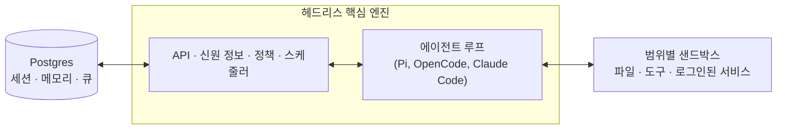

# qm

[English](./README.md) | [日本語](./README_ja.md) | [Español](./README_es.md) | [中文](./README_zh-CN.md) | **한국어**


업무를 위한 멀티플레이어 에이전트 허스크. Slack과 웹에서 사용 가능합니다.


## QM이란 무엇인가요?

대부분의 에이전트는 개인 비서 형태로 설계됩니다. 하나의 에이전트를 전체 회사에서 사용할 수는 있지만, 곧 복잡해집니다. QM은 스타트업을 위해 설계되었습니다. 각 직원은 고유한 격리된 작업 공간을 가지며 서로 방해받지 않고 독립적으로 작업할 수 있으며, 채널, 그룹 메시지, 프로젝트 내에서도 에이전트와 협업할 수 있습니다.

각 개인과 각 공간은 자신만의 범위가 지정된 메모리, 파일, 키체인 보기, 권한, 크론 설정, 웹 앱, 그리고 지속적인 샌드박스를 가집니다.

이 제품은 오픈소스를 염두에 두고 구축되었습니다. 원하는 허스크와 모델을 선택하여 자유롭게 전환할 수 있습니다. Pi, OpenCode, Codex, Claude Code 모두 동일한 핵심 엔진을 사용하므로, 배포가 특정 공급업체에 종속되지 않습니다.

## 주요 기능

- **개인용 및 공유형 범위.** 사용자는 에이전트를 자신만의 것으로 맞춤화할 수 있으며, 동시에 Slack 채널 및 프로젝트 내에서 협력적으로 사용할 수 있습니다.
- **Slack 및 웹.** 동일한 신원 정보와 설정이 Slack과 웹 앱 사이에서 그대로 이어집니다.
- **관리자 제어.** 조직 전체의 설정, 보안 정책, 그리고 사용 가능한 허스크와 모델을 지정할 수 있습니다.
- **웹 앱.** 맞춤형 내부 앱을 만들어 적절한 사람들에게 배포할 수 있습니다.
- **공유형 스킬.** 스킬은 각 범위에 속하며 허가를 통해 공유될 수 있고, 관리자가 조직 전체로 확장할 수도 있으며 git 저장소에서 스킬 팩을 가져올 수도 있습니다.
- **백그라운드 작업.** 아무도 확인하지 않아도 크론과 워치 기능이 계속 작업을 수행합니다.

## 이 도구로 할 수 있는 일

- 내부 노트, 이메일, 문서, 데이터베이스, 웹 콘텐츠를 함께 검색합니다.
- 회사의 정보 처리 시스템에서 정보를 가져옵니다.
- 내부 앱을 구축하여 적절한 사람들에게 배포하고 데이터를 최신 상태로 유지합니다.
- 과거에 보낸 메시지를 통해 자신만의 글쓰기 스타일을 학습한 후, 라벨과 답장 초안을 포함하여 정해진 일정에 따라 받은 편지함을 분류합니다.
- 기존 저장소에서 작업할 수 있습니다. 테스트를 실행하고 PR을 열며 CI를 모니터링하고 시스템 로그를 확인할 수 있습니다.
- 공유 채널에서 프로젝트 진행 상황을 추적하고 업데이트 및 후속 조치를 게시할 수 있습니다.

## 아키텍처



각 작업 단계는 중앙 핵심 엔진을 거치며, 이 엔진은 다양한 모델과 허스크를 활용하여 응답을 생성합니다. Postgres 지속성 계층은 사용자 데이터, 세션 기록 및 기타 영구적인 상태를 저장합니다. 에이전트는 작고 고정된 도구 집합을 가지며, 그 중 하나인 `execute`는 해당 범위의 격리된 샌드박스 내에서 명령을 실행합니다. 이 샌드박스는 영구적인 컴퓨터로, 설치된 도구들은 그대로 유지됩니다. 웹 UI, 관리자 패널, 공개 포털은 핵심 엔진의 HTTP API 위에 추가되는 선택적 플러그인입니다. Slack은 핵심 엔진이 직접 시작하고 관리하는 선택적 인-프로세스 플러그인입니다.

핵심 엔진은 Node에서 TypeScript를 직접 실행하며 HTTP 통신에는 Fastify를 사용합니다. Slack 플러그인은 Bolt를 사용하고, 웹 UI는 Vite로 빌드되며 Lit으로 렌더링됩니다.

핵심 엔진 자체는 범용적입니다. 특정 회사에만 해당하는 모든 요소 — 조직 설정, 맞춤형 도구 및 스킬, 샌드박스 이미지, 인프라 — 는 **배포 디렉터리**에 저장됩니다. [`qm` CLI](./cli/README.md)가 이 디렉터리를 검증하고 배포합니다. 모든 구성 요소(허스크, 세션 저장소, 샌드박스, 메모리)는 인터페이스 뒤에 위치하므로, 실제 운영 환경에서는 하나의 연결 파일을 통해 교체됩니다.

## 보안 및 기밀 정보

QM의 접근 방식은 OpenCode, Codex, Claude Code와 같은 로컬 코딩 에이전트와 유사합니다. 에이전트는 자신이 속한 조직의 사용자로서 행동하며, 해당 사용자의 자격 증명과 권한을 가지고 작업하며, 모든 작업은 감사 대상이 됩니다. 조직은 보안 정책을 선택하며, 더 좁은 범위의 설정은 이 정책을 더욱 엄격하게 적용할 수 있습니다.

- **Strict** — 두 가지 무효 종료 기능을 제외한 모든 허스크 도구 호출은 인간의 승인을 기다립니다.
- **Auto** (기본값) — 분류기가 모델에 도달하기 전에 출처가 명시된 외부 데이터와 도구 결과를 검사합니다. 배포 시 자체 검사 프록시를 지정할 수 있습니다.
- **Dangerous** — 콘텐츠 검사가 없으며 도구 호출 사이에 일시 정지도 발생하지 않습니다.

미리 정의된 명령 정책 — 승인 규칙 및 재귀적 삭제나 파괴적인 SQL과 같은 작업에 대한 엄격한 차단 — 은 Dangerous 모드를 포함한 모든 보안 정책에서 적용됩니다.

[`SECURITY.md`](./SECURITY.md)에는 위협 모델, 운영자에 대한 가정 사항, 그리고 알려진 한계 사항이 기재되어 있습니다.

## 조직용으로 배포하기

`@yc-software/qm`에 의존하는 조직 소유의 배포 저장소를 만듭니다:

```bash
npm exec --yes --package=@yc-software/qm@latest -- \
  qm init. --org <slug> --target <fly-or-aws>
npm install
```

이 과정을 통해 에이전트용 배포 스킬이 생성되며, 인프라, 웹 로그인, 커넥터 자격 증명, 선택적 Slack 접근 권한, 배포, 실시간 검증 등의 단계가 순차적으로 진행됩니다. 소스 코드를 체크아웃할 필요가 없습니다. 각 배포는 운영자의 자체 클라우드 계정에서 실행되며, 초기화 과정에서는 배포용 CI가 생성되거나 활성화되지 않으며, 이 저장소에는 실제 운영 환경용 배포 워크플로우가 존재하지 않습니다. 자세한 내용은 [`deployment.md`](./deployment.md)를 참조하세요.

## 기여하기

저희는 기여를 코드가 아닌 _사람이 직접 작성한_ 텍스트 형태로 받습니다. 자세한 내용은 [`CONTRIBUTING.md`](./CONTRIBUTING.md)를 참조하세요. 변경하고자 하는 내용을 [`adrs/`](./adrs/)에 있는 `.txt` 또는 `.md` 파일에 비공식적으로 기술해 주시면, 저희가 내용이 적합하다고 판단될 경우 구현을 진행하겠습니다. 취약점을 발견하면 비공개적으로 보고해 주시기 바랍니다. 공개 이슈가 아닌 [`SECURITY.md`](./SECURITY.md)를 참조해 주세요.

## 인스턴스 맞춤화하기

위에서 설명한 배포 저장소에는 설정 파일과 샌드박스 계층이 포함되어 있으며, 소스 코드를 체크아웃할 필요가 전혀 없습니다. 일부 조직은 반대 방식을 선호합니다. 즉, 전체 코드베이스를 한 곳에 모아 엔지니어와 코딩 에이전트가 핵심 코드와 맞춤 설정을 함께 확인할 수 있도록 하면서도, 맞춤 설정 자체는 비공개로 유지하고자 합니다. 이를 위해서는 **비공개 포크**를 만들어야 합니다. 이는 qm의 클론으로 시작되는 독립적인 비공개 저장소로, 핵심 코드는 상위 버전과 동일하게 유지됩니다.

한 번만 채워 넣은 후 다음과 같은 방식으로 복제하여 사용할 수 있습니다:

```bash
gh repo create <org>/qm-private --private

git clone --bare git@github.com:yc-software/qm qm-seed.git
git -C qm-seed.git push --mirror git@github.com:<org>/qm-private
rm -rf qm-seed.git

git clone git@github.com:<org>/qm-private
git -C qm-private remote add upstream git@github.com:yc-software/qm
```

위와 같이 일반적인 클론 방식을 사용하여 비공개 포크를 만들어야 하며, GitHub의 포크 기능을 사용해서는 안 됩니다. 여기서 “포크”라는 용어는 의도적으로 분기된 하위 복사본이 상위 버전과 병합되는 개념을 나타내며, GitHub의 포크 버튼과는 다릅니다. GitHub 포크는 원본 저장소의 가시성을 그대로 상속받으므로, 공개 저장소의 포크는 비공개로 만들 수 없습니다. 또한 GitHub 포크는 원본 저장소와 동일한 객체 네트워크를 공유하므로, 포크에 푸시된 커밋은 공개 측에서 SHA 값을 통해 계속 조회할 수 있습니다. 많은 조직에서는 비공개 저장소의 포크를 금지하기도 합니다. 일반적인 클론 방식은 이러한 문제가 전혀 없으며, 단 한 가지 단점이 있습니다. 즉, 클론된 저장소는 일반 저장소이므로 상위 버전의 CI 워크플로우가 사용자의 계정에서 직접 실행됩니다. 따라서 해당 워크플로우에 필요한 기밀 정보를 제공하거나, 원하지 않는 워크플로우는 비활성화해야 합니다.

조직에만 해당하는 모든 내용은 `deploy/layers/<org>/`에 저장됩니다. 여기에는 설정 파일, 샌드박스 도구 및 스킬, 플러그인 이미지, 인프라 등이 포함되며, 형식은 `qm init`이 생성하는 형태와 동일합니다. 자세한 내용은 [`deploy/layers/README.md`](./deploy/layers/README.md)를 참조하세요. 핵심 코드는 상위 버전과 바이트 단위로 동일하게 유지되므로 병합 작업이 간단해집니다.

두 가지 스킬이 양방향으로 경계를 유지합니다. `update-qm`은 상위 버전의 qm을 비공개 포크에 병합하고 동기화 PR을 엽니다. `upstream-pr`은 조직과 무관한 수정 사항을 qm으로 다시 보내며, `upstream/main` 브랜치에서 분기된 후, 푸시하기 전에 출발점과의 차이, 커밋 메시지, 스크린샷에 조직 식별자가 포함되어 있는지 확인합니다. `deploy/layers/` 아래에 있는 내용은 절대로 상위 버전으로 전송되지 않습니다.

## 더 깊이 알아보기

- [`docs/getting-started.md`](./docs/getting-started.md) — 처음 실행하기, 전체 흐름
- [`cli/README.md`](./cli/README.md) — `qm` CLI와 배포 디렉터리 계약
- [`docs/deploy-directory.md`](./docs/deploy-directory.md) — 배포 디렉터리에 대한 상세 설명
- [`.env.example`](./.env.example) — 모든 설정 항목이 상세히 문서화되어 있음
- [`plugins/`](./plugins) — 사용 가능한 인터페이스들 (Slack, 웹 UI, 관리자 패널, 포털)

## 라이선스

별도의 명시가 없는 한, QM은 [MIT License](./LICENSE)에 따라 제공됩니다.
