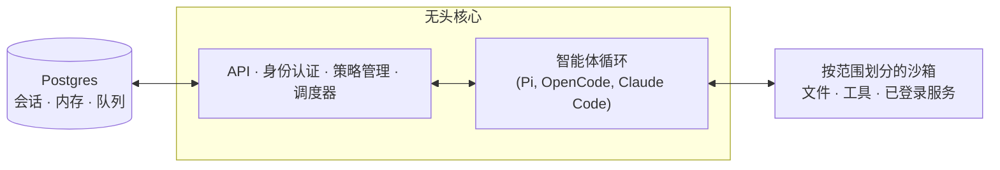

# qm

[English](./README.md) | [日本語](./README_ja.md) | [Español](./README_es.md) | **中文** | [한국어](./README_ko.md)


一款用于工作的多用户智能体工具，支持 Slack 与网页端使用。


## 什么是 QM？

大多数智能体都被设计成类似个人助手的形态。虽然可以让它为整个公司服务，但很快就会变得复杂。QM 是专为初创公司设计的。每位员工都能拥有独立的隔离工作空间，可以独立工作而互不干扰，同时还能在频道、群组消息和项目中与该智能体协作。

每个人和每个工作空间都有自己独立的记忆空间、文件、密钥链视图、权限、定时任务、网页应用以及持久化沙箱。

QM 采用开源理念构建。你可以自行选择驱动引擎和模型，并在它们之间切换——Pi、OpenCode、Codex 和 Claude Code 都使用相同的底层核心，因此部署不会绑定于任何单一供应商。

## 功能特性

- **个人级与共享级范围。** 用户可以自定义智能体以适应个人需求，同时仍能在 Slack 频道和项目中与他人协作使用它。
- **Slack 与网页端互通。** 在 Slack 和网页应用之间，身份和配置可以保持一致。
- **管理员控制。** 可设置组织级配置、安全策略，以及允许使用的驱动引擎和模型。
- **网页应用。** 可以创建自定义的内部应用，并将其发布给指定人员。
- **共享技能。** 技能属于特定范围，可通过授权进行共享；管理员可决定将其推广到整个组织，也可从 Git 仓库导入技能包。
- **后台任务。** 即使没有人在操作，定时任务和监控机制也会持续运行。

## 使用它可以做什么

- 联合搜索内部笔记、邮件、文档、数据库及网络内容
- 从公司的“大脑”中获取信息
- 构建内部应用，将其发布给合适的人，并保持数据实时更新
- 通过过往发送的内容学习自己的写作风格，然后按计划对收件箱进行分类处理——包括标签添加和回复草稿功能
- 在现有的代码库中工作：运行测试、提交 Pull Request、监控持续集成流程、查看系统日志
- 在共享频道中跟踪项目进度，并发布更新和后续进展

## 架构



每一次交互都会经过一个中央核心，该核心可以使用多种模型和驱动引擎来生成响应。Postgres 持久层用于存储用户数据、会话历史及其他持久化状态。智能体拥有一个小型且固定的工具集；其中之一是 `execute`，它会在该范围专属的隔离沙箱中执行命令——也就是它的“持久计算机”，安装的工具会一直保留。网页界面、管理员面板和公共门户都是基于核心 HTTP API 的可选插件；Slack 则是一个可选的进程内插件，由核心通过直接的服务客户端启动并监督。

核心直接在 Node 上运行 TypeScript，并使用 Fastify 处理 HTTP 请求。Slack 插件使用 Bolt；网页界面则基于 Vite 构建，并使用 Lit 进行渲染。

核心本身是通用的。每个公司特有的内容——如组织配置、自定义工具和技能、沙箱镜像、基础设施等——都保存在 **部署目录** 中，[`qm` CLI](./cli/README.md) 会负责验证并部署这些内容。所有的底层组件（驱动引擎、会话存储、沙箱、内存）都通过接口进行访问，因此生产环境中的实现只需通过一个配置文件即可替换。

## 安全性与机密信息

QM 的设计理念与 OpenCode、Codex 和 Claude Code 等本地编程智能体类似：智能体会以所在组织的身份行事，使用该组织的凭证和权限，其所有操作都会被审计。组织可以选择一种安全策略，而更细粒度的范围只能在此基础上进一步收紧：

- **严格模式** —— 除两种无实际影响的操作结束指令外，每次调用驱动引擎工具前都需要人工审批。
- **自动模式**（默认） —— 分类器会在外部数据及工具结果进入模型之前，先对其来源标签进行筛选；部署时也可以指定使用自身的筛选代理。
- **危险模式** —— 不进行内容筛选，工具调用之间也不需要暂停。

预先定义的命令策略——包括审批规则以及对递归删除或破坏性 SQL 操作的硬性禁止——在所有模式下都有效，包括危险模式。

[`SECURITY.md`](./SECURITY.md) 中详细介绍了威胁模型、操作假设以及已知的局限性。

## 为您的组织进行部署

创建一个属于组织的部署仓库，该仓库需依赖 `@yc-software/qm`：

```bash
npm exec --yes --package=@yc-software/qm@latest -- \
  qm init. --org <slug> --target <fly-or-aws>
npm install
```

初始化过程会为智能体创建一个部署技能，并依次完成基础设施配置、网页登录设置、连接器凭证配置、可选的 Slack 访问权限设置、部署操作以及实时验证——无需检出源代码。每次部署都在操作者的自有云账户中运行；初始化不会生成或启用部署相关的持续集成流程，且该仓库也没有生产环境部署的工作流。详情请参阅 [`deployment.md`](./deployment.md)。

## 贡献代码

我们接受的贡献是**人工编写的文本**，而非代码——请参阅 [`CONTRIBUTING.md`](./CONTRIBUTING.md)。请在 [`adrs/`](./adrs/) 目录下的 `.txt` 或 `.md` 文件中非正式地描述您想要进行的修改，如果我们认可，就会负责实现它。如发现漏洞，请私下报告——请参阅 [`SECURITY.md`](./SECURITY.md)，而非在公开 Issue 中提交。

## 自定义您的实例

上述的部署仓库已包含配置和沙箱层，且完全不需要检出源代码。有些组织希望采用相反的方式：将整个代码库集中在一处，这样工程师和编程智能体可以一起查看核心代码和自定义内容，同时这些自定义内容仍保持私密。为此，可以创建一个**私有分支**：即一个独立的私有仓库，其历史记录始于对 qm 的克隆，且其核心代码与上游版本完全一致。

先填充一次该私有分支，然后再克隆出来使用：

```bash
gh repo create <org>/qm-private --private

git clone --bare git@github.com:yc-software/qm qm-seed.git
git -C qm-seed.git push --mirror git@github.com:<org>/qm-private
rm -rf qm-seed.git

git clone git@github.com:<org>/qm-private
git -C qm-private remote add upstream git@github.com:yc-software/qm
```

请务必通过上述方式创建私有分支，切勿使用 GitHub 的“Fork”功能。“Fork”在这里指的是一种刻意分离后再从上游合并的下游副本概念，而非 GitHub 的 Fork 按钮。GitHub 的 Fork 会继承其来源仓库的可见性，因此公共仓库的 Fork 无法设置为私有。此外，GitHub 的 Fork 与其来源仓库共享同一个对象网络，所以推送到 Fork 的提交内容仍然可以通过 SHA 值从公共端获取。许多组织也禁止对私有仓库进行 Fork 操作。而普通克隆则不存在这些问题，唯一的代价是：由于克隆后的仓库属于普通仓库，上游的持续集成工作流将在您的账户中直接运行。您需要提供这些工作流所需的机密信息，或者禁用那些您不希望运行的工作流。

所有与您组织相关的内容都应放入 `deploy/layers/<org>/` 目录中——包括配置、沙箱工具和技能、插件镜像、基础设施等，格式与 `qm init` 生成的格式相同。详情请参阅 [`deploy/layers/README.md`](./deploy/layers/README.md)。核心代码与上游版本完全一致，这正是保持合并操作规模较小的原因。

有两个技能负责在两个方向上维护边界。`update-qm` 负责将上游的 qm 合并到私有分支中，并创建同步 Pull Request；`upstream-pr` 则负责将不依赖于特定组织的修复内容发回 qm，在推送之前会切断与 `upstream/main` 分支的连接，并检查输出的差异、提交信息以及截图中是否包含组织标识。`deploy/layers/` 目录下的任何内容都不会被上传到上游。

## 深入了解

- [`docs/getting-started.md`](./docs/getting-started.md) —— 首次运行及完整流程
- [`cli/README.md`](./cli/README.md) —— `qm` CLI 以及部署目录规范
- [`docs/deploy-directory.md`](./docs/deploy-directory.md) —— 部署目录的完整说明
- [`.env.example`](./.env.example) —— 所有参数均有详细文档说明
- [`plugins/`](./plugins) —— 各种界面（Slack、网页界面、管理员面板、公共门户）

## 许可协议

除非另有说明，QM 采用 [MIT 许可协议](./LICENSE) 发布。
