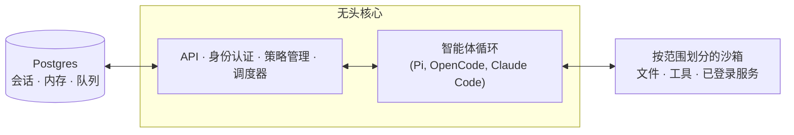

# qm

一款专为工作设计的多人智能体工具。可在 Slack 及网页端使用。它从设计之初就以开源为理念。你可以自行选择驱动引擎与模型，并在它们之间切换——Pi、OpenCode、Codex 和 Claude Code 均基于同一核心运行，因此部署无需绑定于任何单一供应商。


## 什么是 QM？

大多数智能体都是按照个人助手的模式设计的。虽然可以让它为整个公司服务，但很快就会变得复杂。QM 是为初创公司打造的。每位员工都能拥有独立的隔离工作空间，自主工作且互不干扰，同时还能在频道、群组消息和项目中与该智能体协作。

每个人和每个空间都拥有独立的记忆范围、文件、密钥链视图、权限、定时任务、网页应用以及持久化沙箱。

它从设计之初就以开源为理念。你可以自行选择驱动引擎与模型，并在它们之间切换——Pi、OpenCode、Codex 和 Claude Code 均基于同一核心运行，因此部署无需绑定于任何单一供应商。

## 功能特性

- **个人与共享范围。** 用户可以自定义智能体使其成为“专属工具”，同时仍能在 Slack 频道和项目中与他人协作使用。
- **Slack 与网页端互通。** 相同的身份和配置可在 Slack 与网页应用之间同步。
- **管理员控制。** 可设置组织级配置、安全策略，以及允许使用的驱动引擎和模型。
- **网页应用。** 可创建自定义的内部应用，并将其推送给相应人员。
- **共享技能。** 技能属于特定范围，可通过授权进行共享；管理员可决定将其推广到整个组织，也可从 Git 仓库导入技能包。
- **后台任务。** 即使无人操作，定时任务和监控机制也会持续执行工作。

## 使用它可以做什么

- 联合搜索内部笔记、邮件、文档、数据库及网络信息
- 从公司的“大脑”中获取信息
- 构建内部应用，将其推送给合适的人士，并保持数据最新
- 通过过往发送的内容学习自己的写作风格，然后按计划对收件箱进行分类处理——包括标签添加和回复草稿
- 在现有代码库中工作：运行测试、提交 Pull Request、监控持续集成流程、查看系统日志
- 在共享频道中跟踪项目进度，并发布更新与后续消息

## 架构



每一次操作都会经过中央核心处理，该核心可使用多种模型和驱动引擎来生成响应。Postgres 持久层用于存储用户数据、会话历史及其他持久化状态。智能体拥有一个小型且固定的工具集；其中之一是 `execute`，它会在该范围的独立沙箱中执行命令——即它的持久化计算环境，安装在此处的工具会一直保留。网页 UI、管理员面板和公共门户都是基于核心的 HTTP API 的可选插件；Slack 则是一个可选的进程内插件，由核心通过直接的服务客户端启动并监督。

核心直接在 Node 上运行 TypeScript，并使用 Fastify 处理 HTTP 请求。Slack 插件使用 Bolt；网页 UI 则基于 Vite 构建，并使用 Lit 进行渲染。

核心本身是通用的。每个公司特有的内容——如组织配置、自定义工具和技能、沙箱镜像、基础设施——都保存在 **部署目录** 中，[`qm` CLI](./cli/README.md) 会对此目录进行验证并完成部署。所有的底层组件（驱动引擎、会话存储、沙箱、内存）都通过接口隔离，因此生产环境中的实现只需通过一个配置文件即可替换。

## 安全性与机密信息

QM 的设计思路与 OpenCode、Codex 和 Claude Code 等本地编程智能体一致：智能体会以所在组织的身份行事，使用相应的凭证和权限，其所有操作都会被审计。组织可选择一种安全策略，而更细粒度的范围只能在此基础上进一步收紧：

- **严格模式** —— 除两种不会产生实际影响的操作结束指令外，每次调用驱动引擎工具前都需要人工审批。
- **自动模式**（默认） —— 分类器会在外部数据及工具结果进入模型之前对其进行来源标记筛选；部署时可指定使用自身的筛选代理。
- **危险模式** —— 不进行内容筛选，工具调用之间也不需要暂停。

预先定义的命令策略——包括审批规则以及对递归删除或破坏性 SQL 操作的硬性禁止——在所有模式下均适用，包括危险模式。

[`SECURITY.md`](./SECURITY.md) 中详细介绍了威胁模型、操作假设以及已知的局限性。

## 为您的组织进行部署

创建一个属于组织的部署仓库，该仓库需依赖 `@yc-software/qm`：

```bash
npm exec --yes --package=@yc-software/qm@latest -- \
  qm init. --org <slug> --target <fly-or-aws>
npm install
```

初始化过程会为智能体创建一个部署技能，并依次处理基础设施、网页登录、连接器凭证、可选的 Slack 访问权限、部署以及实时验证——无需检出源代码。每次部署都在操作员的自有云账户中运行；初始化不会生成或启用部署相关的持续集成流程，且该仓库也没有生产环境部署的工作流。详情请参阅 [`deployment.md`](./deployment.md)。

## 贡献代码

我们接受的贡献形式是**人工编写的文本**，而非代码——请参阅 [`CONTRIBUTING.md`](./CONTRIBUTING.md)。请在 [`adrs/`](./adrs/) 目录下的 `.txt` 或 `.md` 文件中非正式地描述您希望做出的修改，如果我们认可，就会负责实现它。如发现漏洞，请私下报告——请参阅 [`SECURITY.md`](./SECURITY.md)，而非在公开 Issue 中提交。

## 自定义您的实例

上述部署仓库已包含配置和沙箱层，且完全无需检出源代码。有些组织则希望采用相反的方式：将整个代码库集中在一处，这样工程师和编程智能体可以一起查看核心代码与自定义内容，同时这些自定义内容保持私密。为此，可以保留一个**私有分支**：即一个独立的私有仓库，其历史记录始于对 qm 的克隆，且其核心代码与上游版本完全相同。

先填入所需内容，然后再克隆出来使用：

```bash
gh repo create <org>/qm-private --private

git clone --bare git@github.com:yc-software/qm qm-seed.git
git -C qm-seed.git push --mirror git@github.com:<org>/qm-private
rm -rf qm-seed.git

git clone git@github.com:<org>/qm-private
git -C qm-private remote add upstream git@github.com:yc-software/qm
```

请通过上述方式创建私有分支，切勿使用 GitHub 的“Fork”功能。“Fork”在这里指的是刻意分离并向上游合并的下游副本概念，而非 GitHub 的 Fork 按钮。GitHub 的 Fork 会继承其来源仓库的可见性，因此公共仓库的 Fork 无法设置为私有。此外，GitHub 的 Fork 与其来源仓库共享同一个对象网络，所以推送到 Fork 的提交仍然可以通过 SHA 从公共端获取。许多组织也禁止对私有仓库进行 Fork 操作。而普通克隆则不存在这些问题，唯一的代价是：克隆后的仓库属于普通仓库，因此上游的持续集成工作流会在你的账户中直接运行。你需要提供这些工作流所需的机密信息，或者禁用那些你不希望运行的工作流。

所有属于你所在组织的特定内容都应放入 `deploy/layers/<org>/` 目录中——包括配置、沙箱工具和技能、插件镜像、基础设施等，格式与 `qm init` 生成的格式一致。详情请参阅 [`deploy/layers/README.md`](./deploy/layers/README.md)。核心代码与上游版本完全一致，这正是保持合并操作规模较小的原因。

有两个技能负责在两个方向上维护边界。`update-qm` 会将上游的 qm 合并到私有分支中，并创建同步 Pull Request；`upstream-pr` 则会将与组织无关的修复内容发回 qm，在推送之前会切断与 `upstream/main` 分支的连接，并检查输出内容的差异、提交信息以及截图中是否包含组织标识。`deploy/layers/` 目录下的任何内容都不会被上传到上游。

## 深入了解

- [`docs/getting-started.md`](./docs/getting-started.md) —— 首次运行及完整流程
- [`cli/README.md`](./cli/README.md) —— `qm` CLI 与部署目录规范
- [`docs/deploy-directory.md`](./docs/deploy-directory.md) —— 部署目录的完整说明
- [`.env.example`](./.env.example) —— 所有参数均有详细文档说明
- [`plugins/`](./plugins) —— 各种界面（Slack、网页 UI、管理员面板、公共门户）

## 许可协议

除非另有说明，QM 采用 [MIT 许可证](./LICENSE) 发布。
